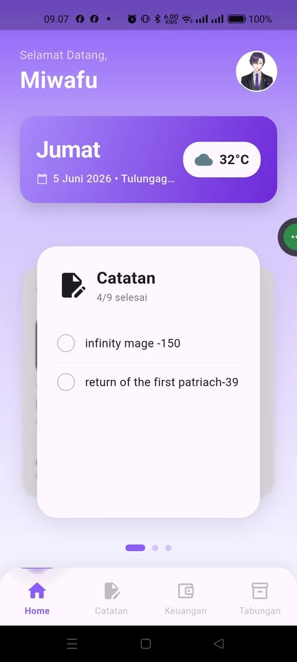
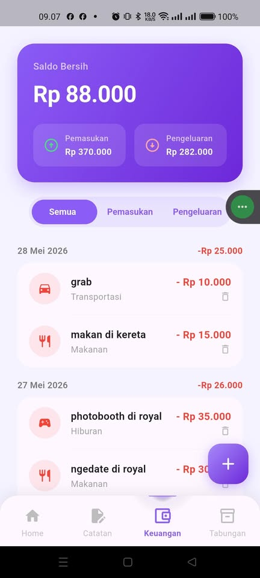
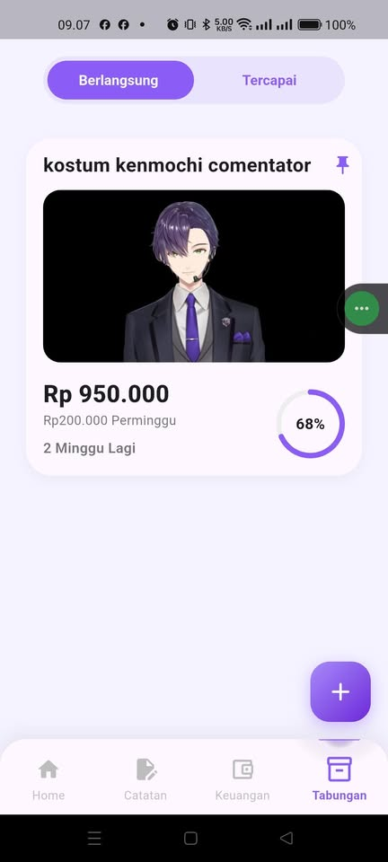
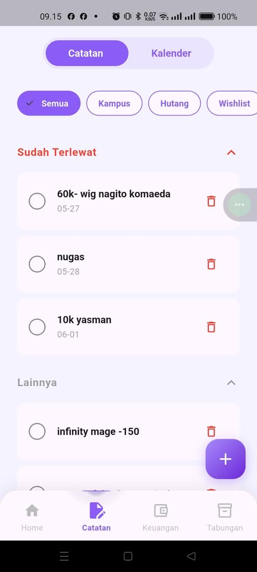
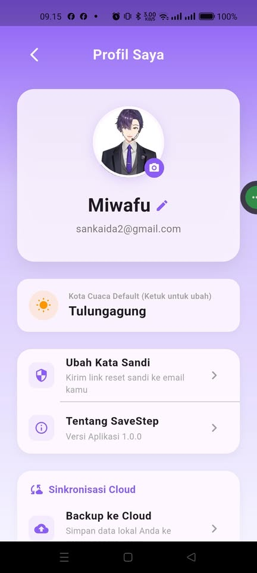

<div align="center">

# 💜 SaveStep
### Aplikasi Mobile Manajemen Keuangan Personal

*Kendali penuh atas keuangan Anda — kapan saja, di mana saja.*


</div>

---

## 📖 Deskripsi Aplikasi

**SaveStep** adalah aplikasi mobile manajemen keuangan personal yang dikembangkan menggunakan **Flutter** dengan pendekatan **Clean Architecture** dan sistem **Offline-First**. Aplikasi ini dirancang untuk membantu mahasiswa dan generasi muda dalam mengelola keuangan sehari-hari secara efisien, terstruktur, dan menyenangkan.

SaveStep mengintegrasikan sistem pelacakan transaksi, manajemen kategori dinamis, pengelolaan target tabungan, serta modul perencanaan jadwal (*planner*) dalam satu antarmuka yang intuitif — sehingga pengguna dapat memantau kesehatan finansial mereka secara menyeluruh tanpa perlu berpindah-pindah aplikasi.

---

## ✨ Fitur Utama

### 💰 Manajemen Keuangan (Finance)
- ✅ Catat **pemasukan dan pengeluaran** dengan cepat
- ✅ **Kategori dinamis** — tambah, edit, dan hapus kategori sendiri
- ✅ Pembaruan otomatis seluruh transaksi saat kategori diubah (*Cascading Update*)
- ✅ Ringkasan **saldo bersih** secara real-time
- ✅ Filter dan riwayat transaksi per kategori

### 🐷 Target Tabungan (Savings)
- ✅ Buat **target tabungan** dengan nama, nominal, dan periode
- ✅ Visualisasi progres dengan **Circular Progress Bar**
- ✅ Fitur **top-up saldo** tabungan kapan saja
- ✅ **Pin tabungan favorit** ke posisi teratas
- ✅ Status otomatis "Tercapai 🎉" saat target terpenuhi

### 📅 Planner & Kalender
- ✅ Kalender interaktif untuk manajemen jadwal dan catatan
- ✅ **Hari libur nasional Indonesia** ditampilkan otomatis (via API)
- ✅ Tambah catatan dengan kategori dan pengingat waktu
- ✅ **Notifikasi lokal** berbasis waktu (tanpa internet)

### 👤 Profil & Pengaturan
- ✅ Edit profil dan foto pengguna
- ✅ **Dark Mode / Light Mode** switching
- ✅ **Backup data ke Firebase Cloud** (manual, hemat kuota)
- ✅ **Restore data dari Cloud** ke perangkat baru

### 🔐 Autentikasi
- ✅ Login & Register dengan Email/Password
- ✅ **Google Sign-In** satu klik
- ✅ Reset password via email
- ✅ Mode tamu (*Guest/Anonymous*)

---

## 🛠️ Teknologi yang Digunakan

### Lingkungan Pengembangan
| Komponen | Spesifikasi |
|:---|:---|
| Framework | Flutter SDK 3.41.2 (Stable) |
| Bahasa | Dart 3.11.0 |
| IDE | Visual Studio Code |
| OS | Windows 11 Pro 64-bit |
| Perangkat Uji | Android API 34 / Real Device |

### Library & Dependensi Utama
| Kategori | Package | Versi |
|:---|:---|:---|
| State Management | `flutter_riverpod` | 3.3.1 |
| Backend & Database | `cloud_firestore` | 6.4.1 |
| Autentikasi | `firebase_auth` | 6.4.0 |
| Penyimpanan Lokal | `shared_preferences` | 2.5.5 |
| HTTP Client / API | `dio` | 5.9.2 |
| Notifikasi Lokal | `flutter_local_notifications` | 21.0.0 |
| UI Kalender | `table_calendar` | 3.2.0 |
| Kamera & Galeri | `image_picker` | 1.1.2 |

### Arsitektur
Aplikasi ini menggunakan **Clean Architecture** dengan pendekatan **Feature-First**:
```
lib/
├── core/           # Infrastruktur dasar (database, API, notifikasi)
├── features/       # Logika bisnis per fitur (auth, finance, savings, planner)
├── screens/        # Tampilan UI per halaman
├── services/       # Autentikasi Firebase
└── widgets/        # Komponen UI global
```

---

## 📸 Screenshot

> *Tampilan antarmuka aplikasi SaveStep*

| Dashboard | Keuangan | Tabungan |
|:---:|:---:|:---:|
|  |  |  |
| **Home / Dashboard** | **Catatan Keuangan** | **Target Tabungan** |

<br>

| Planner / Notes | Profil Pengguna |
|:---:|:---:|
|  |  |
| **Planner & Catatan** | **Pengaturan Profil & Tema** |

---

## 🚀 Cara Menjalankan Aplikasi

### Prasyarat
Pastikan Anda sudah menginstal:
- [Flutter SDK 3.x](https://docs.flutter.dev/get-started/install) (versi stable)
- [Android Studio](https://developer.android.com/studio) atau VS Code dengan ekstensi Flutter
- Perangkat Android (fisik atau emulator) dengan **Android API 21+**
- Koneksi internet (untuk autentikasi Firebase pertama kali)

### Langkah Instalasi

**1. Clone repository ini**
```bash
git clone https://github.com/WahyuMiwap/savestep.git
cd savestep
```

**2. Install semua dependensi**
```bash
flutter pub get
```

**3. Jalankan aplikasi**
```bash
flutter run
```

> ⚠️ **Catatan:** File `firebase_options.dart` sudah disertakan dalam repository ini sehingga Anda tidak perlu konfigurasi Firebase ulang. Aplikasi langsung dapat dijalankan setelah `flutter pub get`.

### Build APK (Opsional)
```bash
flutter build apk --release
```
File APK akan tersimpan di: `build/app/outputs/flutter-apk/app-release.apk`

---

## 📁 Struktur Folder

```
savestep/
├── android/                    # Konfigurasi Android native
├── assets/
│   └── images/                 # Aset gambar (logo, ikon)
├── lib/
│   ├── core/
│   │   ├── constants/          # Warna dan konstanta global
│   │   ├── database/           # LocalDB, Firestore, dan SyncService
│   │   ├── network/            # Integrasi API cuaca
│   │   ├── notifications/      # Sistem notifikasi lokal
│   │   ├── providers/          # Theme dan Profile provider
│   │   └── utils/              # Utility (currency formatter, dll)
│   ├── features/
│   │   ├── auth/               # Provider autentikasi Firebase
│   │   ├── dashboard/          # Provider cuaca dashboard
│   │   ├── finance/            # CRUD keuangan & model transaksi
│   │   ├── planner/            # Catatan, kalender, & API hari libur
│   │   └── savings/            # Target tabungan & model tabungan
│   ├── screens/                # UI setiap halaman (auth, finance, savings, dll)
│   ├── services/               # AuthService (login, register, Google)
│   └── main.dart               # Entry point aplikasi
├── panduan/                    # Panduan belajar arsitektur project
└── pubspec.yaml                # Daftar dependensi
```

---

## 👨‍💻 Developers

| No. | Nama Developer |
|:---:|:---|
| 1 | **Muhammad Wahyu Firmansyah** |
| 2 | **Raditya Dinantara Yudha** |
| 3 | **Muhammad Raffi Firmansyah** |

**Mata Kuliah:** Pemrograman Mobile (Flutter)
----

<div align="center">

*Dibuat dengan 💜 menggunakan Flutter & Firebase*

</div>
